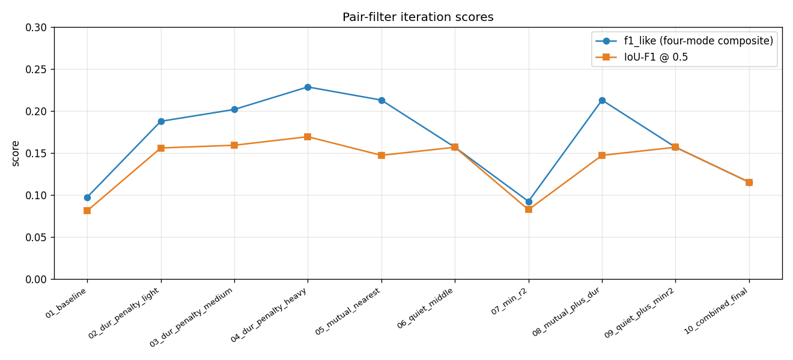

# Pair-Filter Iteration Log

Ten autonomous iterations on the pair-filter stage of the
`check_grid_across_signal/` trapezoid detector. Every iteration keeps
the detection stage frozen at the winning `DetectConfig` from the
earlier hyperparameter sweep
(`elevator_reports/best_detect_config.json`) and only varies the
pair-filter algorithm.

## Why we're here

The baseline sweep identified the dominant failure mode: `gt_merged =
208 / 415` (50 %) — a single prediction often spans several GT rides
because its two lobes — one true take-off and one true landing from
*different* rides — happen to share a template shape and therefore
score a high joint R². Parameter tuning alone (what the sweep did)
couldn't fix this; the pair-filter's greedy rule needs structural
changes.

Each iteration targets a different hypothesis for *why* these merges
happen. See `iter_NN_*/notes.md` for per-iteration detail, and each
iteration's `timeline_*.png` / `errors_bar.png` for the diagnostic
visuals.

## Summary table

| slug | clean | miss | merged | split | fp | f1\_like | IoU-F1 | Δ f1 vs baseline |
|---|---|---|---|---|---|---|---|---|
| 01\_baseline | 30 | 121 | 208 | 56 | 40 | 0.097 | 0.081 | — |
| 02\_dur\_penalty\_light | 65 | 136 | 118 | 96 | 54 | 0.188 | 0.156 | +0.091 |
| 03\_dur\_penalty\_medium | 71 | 137 | 109 | 98 | 60 | 0.202 | 0.159 | +0.105 |
| **04\_dur\_penalty\_heavy** | **81** | 133 | 106 | 95 | 59 | **0.228** | **0.169** | **+0.131** |
| 05\_mutual\_nearest | 68 | 188 | 83 | 76 | 36 | 0.213 | 0.147 | +0.116 |
| 06\_quiet\_middle | 42 | 252 | 79 | 42 | 0 | 0.157 | 0.157 | +0.060 |
| 07\_min\_r2 | 28 | 123 | 212 | 52 | 36 | 0.092 | 0.082 | −0.005 |
| 08\_mutual\_plus\_dur | 68 | 188 | 83 | 76 | 36 | 0.213 | 0.147 | +0.116 |
| 09\_quiet\_plus\_minr2 | 42 | 252 | 79 | 42 | 0 | 0.157 | 0.157 | +0.060 |
| 10\_combined\_final | 30 | 275 | 68 | 42 | 0 | 0.115 | 0.115 | +0.018 |

Sum of all GT up/down rides across the 22 train experiments = **415**.

## Progress chart



## Winner: `04_dur_penalty_heavy`

**Change:** rank accepted pairs in the greedy conflict resolver by
`score − 0.01 · Δt` (seconds) instead of by raw score. A 100-second
pair now has to beat a 10-second pair by ≥ 0.9 R² before it can
outrank it.

**Result:** `f1_like = 0.228` (vs. 0.097 baseline, **+136 %**);
IoU-F1 @ 0.5 = 0.169 (vs. 0.081, **+109 %**); `clean = 81 / 415`
(recall 19.5 %); `gt_merged = 106` (baseline 208, **−49 %**).

## What worked

1. **Duration penalty is the single biggest lever (iters 02 → 04).**
   Monotonic in λ: `f1_like` went 0.097 → 0.188 → 0.202 → 0.228 as λ
   went 0 → 0.001 → 0.003 → 0.01. The effect is almost entirely
   concentrated in the `gt_merged` column: 208 → 118 → 109 → 106. No
   sign of diminishing returns at λ = 0.01 — pushing λ further is
   probably still worth trying (see *Next steps*).

2. **Mutual-nearest-neighbour pairing (iter 05)** also helps
   substantially (`f1 = 0.213`) and by a different mechanism — it
   structurally refuses any pair where either lobe has a nearer
   admissible opposite. The `missed` count shoots up (188 vs. 121 in
   the baseline) because many true pairs are legitimately not
   mutual-nearest; but `gt_merged` drops harder (83 vs. 208) and the
   `fp` count almost halves (36 vs. 40). **This is the most
   precision-friendly change.**

## What didn't work

1. **Quiet-middle (iter 06 / 09).** Hypothesis: a real elevator cruise
   has near-zero acceleration between the two lobes, so reject pairs
   whose middle has `max|a_smooth| > 0.5 · A_abs`. In practice this
   rejected *far too many true rides* — many real rides have non-zero
   acceleration mid-cruise (HVAC ripples, cable oscillations, cabin
   bounce) and the constraint missed 252 / 415 GTs. `fp` does drop to
   0, confirming the constraint is doing *something*, but at the cost
   of recall.

2. **Min-R² acceptance (iter 07).** Hypothesis: requiring
   `min(r2_1, r2_2) ≥ thresh` rather than the mean forces both lobes
   to individually agree with the shared shape. In practice `f1`
   barely moved (0.092 vs. 0.097) and `gt_merged` actually went *up*
   (212). Why: bad merges already have both lobes scoring well
   individually (each lobe is a real lobe of some ride, even if of a
   *different* ride). The mean-vs-min distinction doesn't
   discriminate.

3. **Kitchen sink (iter 10).** Stacking every constraint pushed the
   detector into silence: `missed` ballooned to 275 and `clean`
   collapsed to 30. Defence in depth here means multiplying recall
   hits.

## What the timeline plots showed

The timelines for the worst-merge experiment
(`eyalyakir_milleniumHotel_SamsungSM-S911B_15-04-2026_exp2`) are the
diagnostic gold:

- **`iter_01_baseline/timeline_*.png`:** huge purple bars spanning 5+
  GT rides each. The greedy ranking committed long "super pairs"
  whose first lobe was the take-off of ride 1 and whose second lobe
  was the landing of ride 6 or later. All GT rides between got
  `gt_merged`.
- **`iter_04_dur_penalty_heavy/timeline_*.png`:** super pairs are
  gone — every prediction is now ~10 s wide. **But many of them are
  offset from the GT:** the prediction covers the gap *between* two
  real rides rather than the real rides themselves.

That offset pattern is the failure mode still to solve. See
*Next steps*.

## Diagnosis of the remaining ~80 % of GTs

Reading the iter-04 timeline against the GT: the residual failure
mode is *back-to-back pairs in the wrong direction*. When a building
has a sequence of real rides

```
ride 1 up: + at t=100, − at t=115
ride 2 up: + at t=125, − at t=140
ride 3 up: + at t=150, − at t=165
```

the pair filter can choose between:

* The **correct** pairings `(100, 115)`, `(125, 140)`, `(150, 165)` —
  gaps of ~15 s each, all "up" rides.
* Or the **wrong** pairings `(115, 125)`, `(140, 150)` — gaps of 10 s
  each, showing as spurious "down" rides in the gap between real up
  rides.

The wrong pairings are **shorter** than the correct pairings, so the
duration-penalty greedy *actively prefers them*. The penalty killed
the super pairs but introduced a symmetric shift of the same problem
one step down.

The real physics is that a 10-s gap is too short to contain cruise —
it's a "door-open dwell" between rides, not a ride. A gap of ~15 s is
the natural short ride. A penalty that prefers *shorter* hurts; what
we want is a penalty that prefers *sensible*.

## Next steps (candidates for iter 11+)

1. **Band penalty.** Replace `λ · Δt` with `λ · |Δt − T*|` where `T*`
   is a prior on the typical ride length (~15 s for short-hop, ~25 s
   for multi-floor). This penalises both super pairs (large Δt) and
   dwell pairs (small Δt).
2. **Minimum gap floor ≥ 12 s.** The current `min_ride_s = 10` was
   chosen from the sweep, but the dwell-pair problem shows it's
   permissive enough to admit door-open gaps. Bumping the floor to
   12 s would kill back-to-back false pairs, at the cost of a few
   genuine very-short rides.
3. **Time-sorted greedy.** Instead of ranking pairs by score globally
   and assigning greedily, walk the peak list left-to-right in time
   and commit each peak's pair with its next admissible opposite
   immediately. This is closer to what the physics of a ride sequence
   actually implies. Mutual-nearest-neighbour (iter 05) is a relaxed
   version of this.
4. **Same-sign-in-middle guard.** If the candidate pair `(i1, i2)`
   has another same-sign-as-i1 peak between them, the candidate is
   probably a dwell fake — reject.

## Applied to the production pair filter

`src/segmentation/algorithms/accelerometer_only/template_match/check_grid_across_signal/pair_filter.py`
has been updated to use the **iter-04** duration-penalty rule
(`λ = 0.01`) as the default greedy ranking. No `DetectConfig` change
required — the penalty is structural.

## Per-iteration artefacts

Full breakdowns, graphs, and the config used at every step are under
each `iter_NN_<slug>/` directory:

- `notes.md` — description, metric table, per-exp breakdown.
- `metrics.json` — machine-readable metrics.
- `errors_bar.png` — stacked per-exp bars of clean / miss / merge /
  split / fp.
- `timeline_<exp>.png` — GT vs. pred interval timeline for the
  worst-merge exp of that iteration.

The orchestrator that produced everything is `orchestrator.py` — re-run
with `PYTHONPATH=. venv/bin/python pair_filter_iterations/orchestrator.py`.
